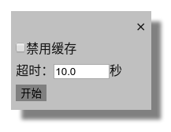
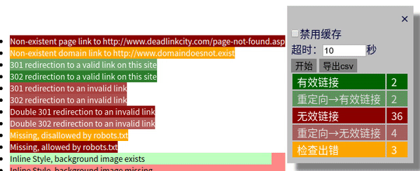
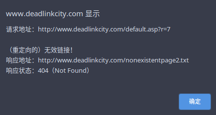

# chrome插件：检查网页链接有效性

## 安装

- [商店安装](https://chrome.google.com/webstore/detail/ckphjpoieajofmlhnfpiloiondkhpcja/publish-review)(审核中)

- 源码安装：进入[chrome插件管理页](chrome://extensions/)开启开发者模式，【加载已解压的扩展程序】，选择`src`目录完成安装。
  

## 开始

设置缓存策略并选择超时阈值，点击开始执行检查。

## 等待执行

黑底白字链接代表正在等待检查。

## 结果查看

1. 执行完成后，插件窗体上显示有结果汇总

2. 同时，根据链接有效性情况，其本身外观也会被改变为相应状态：

   - 绿色表示有效（状态码<400），反之红色无效（状态码≥400）。另外，当无法获取状态码时，显示黄色。
   - 如果闪烁（不论红绿），表示链接被重定向了。

   

3. 【右键链接 - 查看检查结果】可获取具体信息

    

4. 另外可以将结果导出为csv格式